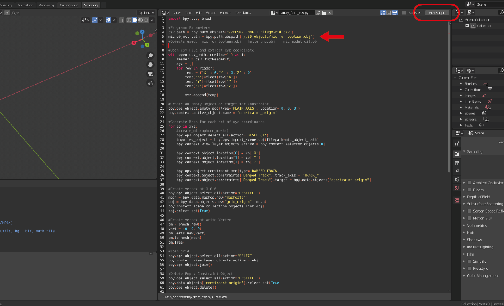

# Python Script for Blender

### Simply clone this directory and start the example_scene_with_script.blend in blender 2.83. Here you can start the script by pressing run script in the top right corner of scripting view. You can choose any of the 3D Objects by changing the path to be arranged according to the provided csv sampling grid information.

### Additionaly, you can find some debug and meshing scripts in the scripts Folder.

