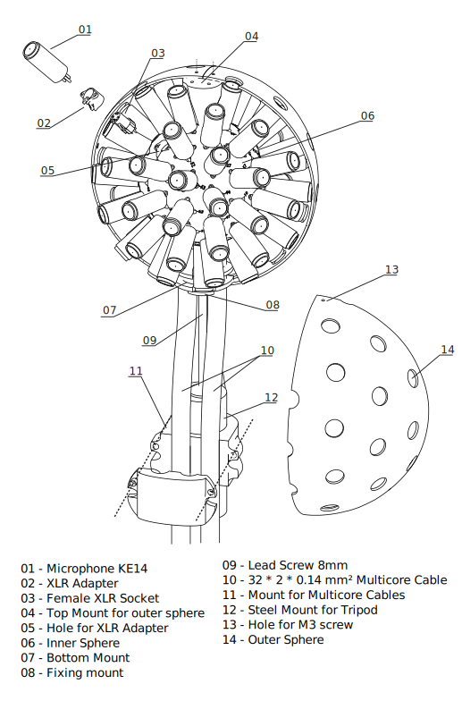
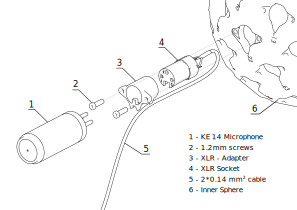
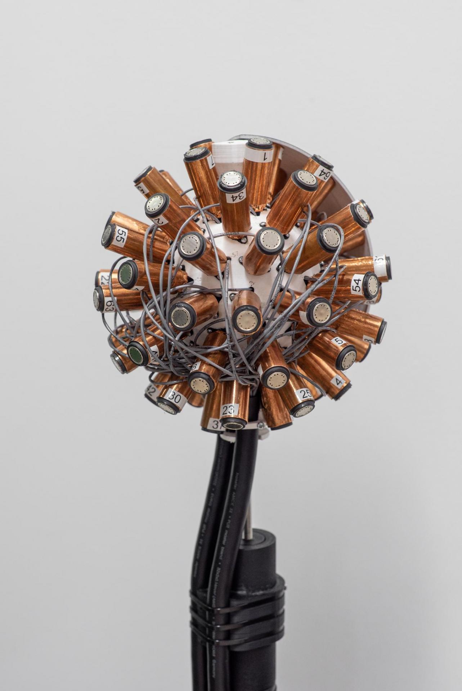

# HØSMA 7n MK II Prototype

 

## [ 3D Models ](3D_Models/README.md)
## [ Microphone Tube ](Microphone_Tube/README.md)
## [ Assembly Instructions ](Assembly_Instructions/README.md)
## [ Example Audio Recordings ](Example_Audio_Recordings/README.md)

 
 

### Our Design is split into two main components an outer and inner sphere. The outer sphere, which resembles the actual outer dimensions of the microphone array splits into four segments and has cutouts for all the microphones. Its main purpose is to fix the microphones to the exact positions defined by the sampling grid without the need to bear any of their weight. In contrast the inner sphere is a smaller hollow structure that was printed in one piece. It has numbered cavities for XLR sockets, and its main purpose is to transfer the weight of all the components into a single steel rod which goes through the center of the array.

 

### To mount the microphones into the array we use XLR sockets which were previously soldered to one of the two multicore cables. Each socket is glued into a 3D printed adapter which in return connects to the inner sphere with small screws.

 

### The microphones can simply be attached into the XLR sockets. We tested and measured all the microphones beforehand and numbered them.
 

### After attaching the four segments of the outer sphere we applied some tape to seal the segments.

  

