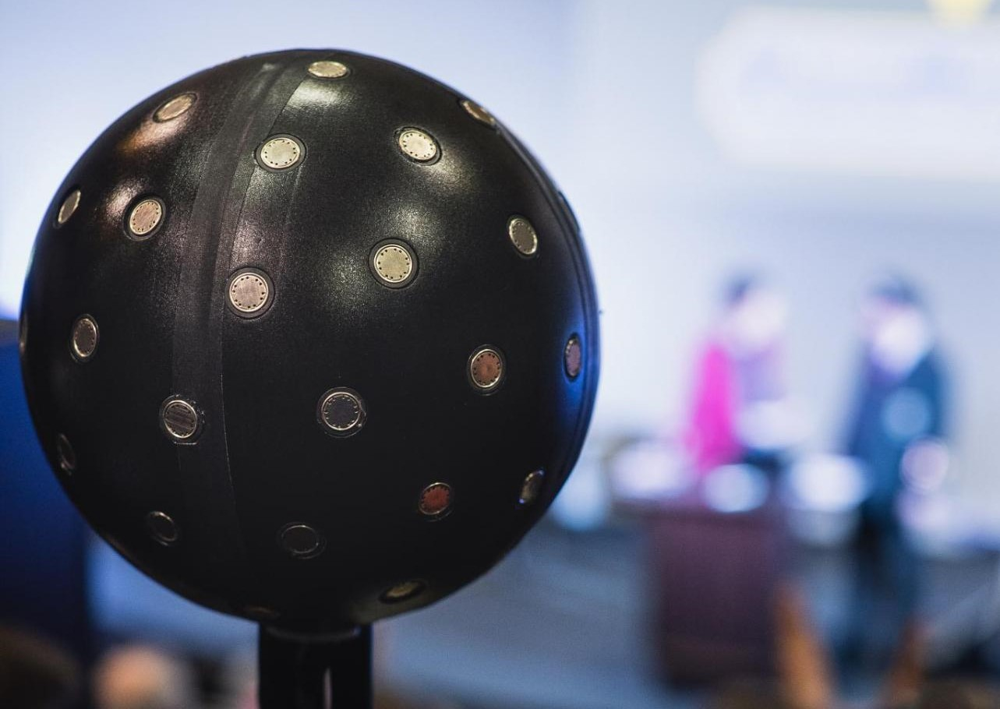
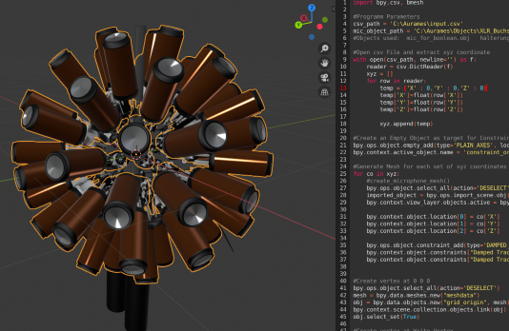

# Development of an Open Source Customizable High Order Rigid Sphere Microphone Array

### Welcome to our GitHub page to our corresponding [ AES E-Brief paper ](www.google.de), in which we describe the development of a high order rigid sphere microphone array with a customizable design concept.
 

## HØSMA 7N MKII Prototype

### We developed a prototype high order spherical microphone array. Based on the Fliege sampling grid, we´ve built a first functional 7th order Prototype with 64 microphones. It has a diameter of 23.5 centimeters and most of its components are 3D printed.

 

  

You can find all the 3D models, some pictures and an assembly manual in the Folder - [ HØSMA 7N MKII ](HOSMA_7N_MKII/README.md)

 

## Python Script for Blender

### We developed a small script which allows the placement of predefined objects for example microphone tubes at the calculated positions of the sampling grid. We used this script extensively to fine tune all the parameters.

 

  

You can find different versions of the script, a small library of 3D Objects and the documentation in the Folder - [ Python Script and Library ](BLENDER_SCRIPTS/README.md)

 

## Additional Information

### All the 3D models, photos and drawings are licensed under the Creative Commons with attribution share alike and noncommercial use.

### All scripts in this repository are licensed under the GNU v3 [ license ](LICENSE.md). 

### For more information about our research visit us[ online ](https://www.th-koeln.de/informations-medien-und-elektrotechnik/technische-akustik_25051.php).
 

  
